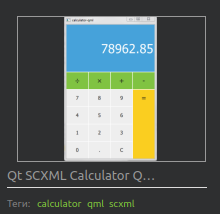
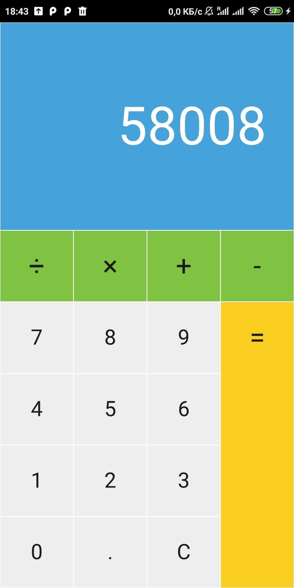

МИНИСТЕРСТВО НАУКИ  И ВЫСШЕГО ОБРАЗОВАНИЯ РОССИЙСКОЙ ФЕДЕРАЦИИ  
Федеральное государственное автономное образовательное учреждение высшего образования  
"КРЫМСКИЙ ФЕДЕРАЛЬНЫЙ УНИВЕРСИТЕТ им. В. И. ВЕРНАДСКОГО"  
ФИЗИКО-ТЕХНИЧЕСКИЙ ИНСТИТУТ  
Кафедра компьютерной инженерии и моделирования
  
### Отчёт по лабораторной работе № 8  по дисциплине "Программирование"
 
​
студента 1 курса группы 191(2)  
 Лисовского Владимира Сергеевича  
 направления подготовки 09.03.01 "Информатика и вычислительная техника" 

  
<table>
<tr><td>Научный руководитель  старший преподаватель кафедры  компьютерной инженерии и моделирования</td>
<td>(оценка)</td>
<td>Чабанов В.В.</td>
</tr>
</table>
  
​
Симферополь, 2020

#### Цель

* Настроить IDE Qt Creator для разработки приложений под android ОС;
* Изучить базовые понятия связанные с мобильной разработкой;
* Научиться создавать мобильные приложения при помощи фреймворка Qt 5.14.

#### Ход работы

1. Указываем пусть к `JDK` в `Qt Creator`.

       
    
    _(рис. 1. Путь указан корректно)_
    
2. Указываем пусть к `SDK` и `NDK` в `Qt Creator`.

       
    
    _(рис. 2. Путь указан корректно)_

3. Выбираем проект для сборки.

    Был выбран проект `Qt SCXML Calculator QML Example`
    
       
    
    _(рис. 3. Выбор проекта)_
    
4. Собираем и запускаем проект.

       
    
    _(рис. 4. Приложение успешно запущено на телефоне)_
    

#### Ввывод

в ходе лабораторной работы были получены такие навыки, как
* умение создавать приложения под Android ОС;
* умение собирать и запускать созданные приложения на устройствах под управлением Android ОС.